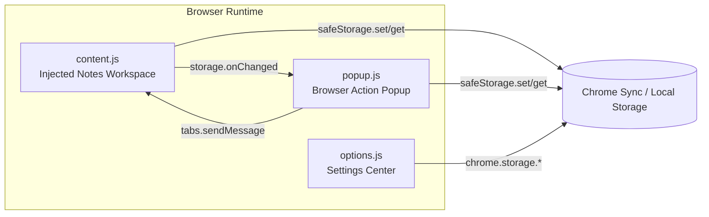

# ✨ ThoughtTag — Delightfully Rich Notes in Any Tab

> 💡 ThoughtTag transforms every web page into a living canvas for your ideas. Capture insights exactly where they happen, keep them synchronized across sessions, and revisit them through a beautifully crafted popup experience.

---

## 🚀 Why ThoughtTag Stands Out
- **In-place thinking** — Create, drag, resize, and pin notes while staying immersed in the page you are exploring.
- **Consistent experience** — A single design system in `style.css` powers the injected workspace, popup dashboard, and options center.
- **Resilient storage** — Notes prefer Chrome Sync, gracefully fall back to `chrome.storage.local`, and mirror to `localStorage` when APIs are unavailable.
- **Tailored workflow** — Toggle dark mode, scope notes per host or per URL, export thoughts, and reopen archived gems in seconds.

---

## 🌟 Feature Highlights
- **Floating toolbar** — Drag the control dock anywhere; its position persists using helpers inside `content.js`.
- **Rich editor** — Bold, italicize, underline, recolor selections, or pick from curated palettes inside each note card.
- **Stateful notes** — Pin for priority, minimize for focus, close to archive, or export as `.txt` for hand-offs.
- **Popup dashboard** — `popup.html` + `popup.js` deliver search, filters, reopen actions, and a polished list view.
- **Options workspace** — `options.html` + `options.js` allow tweaking default dark mode, storage scope, and clearing data.

---

## 🖼️ Screenshots
ThoughtTag pairs a calm, tactile aesthetic with practical density. Screens showcase soft shadows, rounded corners, and consistent typography across injected notes, popup, and options.

<p align="center">
  
  <br/>
  <sub>High‑level view: inject notes directly on any page without breaking your reading flow.</sub>
  <br/><br/>
</p>

<p align="center">
  
  
</p>
<p align="center"><sub>In‑page toolbar & notes • Popup dashboard</sub></p>

<p align="center">
  
  
</p>
<p align="center"><sub>Rich formatting • Options workspace</sub></p>

<p align="center">
  <sub>Tip: Click any image to view it at full resolution.</sub>
</p>

---

## 🧠 Architecture at a Glance


---

## 🗂 Module Tour
### `content.js`
- **Toolbar orchestration** — Builds the draggable toolbar, persists placement, and propagates `.dark-mode` styling to each `pro-note`.
- **Note lifecycle** — Generates note DOM, wires formatting controls, and debounces saves through `saveNotes()`.
- **Storage resilience** — `safeStorage` mediates between Chrome Sync, local storage, and `localStorage` caching.
- **Real-time reconciliation** — Responds to `chrome.storage.onChanged` and `thoughttags:reopen-note` runtime messages.

### `popup.js`
- **Scope-aware loader** — Computes the active storage key (per host or per URL) based on the current tab context.
- **Curated list UI** — Sorts pinned notes, counts archived entries, renders empty states, and supports instant search.
- **Action hub** — Delete, reopen, or queue reopen requests when the content script is not yet ready.

### `options.js`
- **Settings persistence** — Chooses the best available storage area, reads user preferences, and saves scope/dark-mode defaults.
- **Maintenance utilities** — Ships a one-click "Clear all notes" button with confirmation safeguards.

### `style.css`
- **Design system** — Centralizes gradients, typography, shadows, and responsive rules for every surface.
- **Dark mode variants** — Tailors colors for low-light environments across toolbar, notes, popup, and options UI.

---

## 💾 Data & Persistence Strategy
- **Primary target** — `chrome.storage.sync` delivers cross-device continuity.
- **Secondary fallback** — `chrome.storage.local` maintains resilience when sync is unavailable.
- **Offline safety net** — `localStorage` mirrors data while `memoryStore` caches reads during the session.
- **Scoped keys** — Notes are stored per host or per full URL, depending on the selected scope in the options page.

---

## ⚡ Quick Start
1. Enable **Developer mode** at `chrome://extensions/`.
2. Click **Load unpacked** and select this project directory.
3. Pin ThoughtTag from your extension tray.
4. Open any page, tap the toolbar ➕ button, and start capturing insights.

---

## 🧭 Everyday Workflow
1. **Launch the toolbar** — The floating dock appears automatically; park it where it inspires you most.
2. **Capture a note** — Hit ➕ to spawn a rich text note with title, content, and formatting controls.
3. **Style & organize** — Adjust fonts, apply colors, pin priority notes, minimize distractions, or close to archive.
4. **Sync & revisit** — Edits auto-save; use the popup (`popup.js`) to search, filter, delete, or reopen archived notes.
5. **Tune defaults** — Visit the options page to swap between per-site/per-URL scopes or to toggle default dark mode.

---

## 🛠 Customization Tips
- **Dark mode on demand** — Use the toolbar toggle; the preference is persisted for consistent ambience.
- **Color palette tweaks** — Extend the `colors` array within `content.js` to align with your brand or mood.
- **Note defaults** — Adjust starting position, dimensions, or title templates inside `createNoteElement()`.
- **Storage experiments** — Enhance `safeStorage` if you plan to integrate analytics or alternate persistence layers.

---

## 📁 Project Structure
```text
ThoughtTag-ChromeExtension/
├── manifest.json
├── content.js
├── popup.html
├── popup.js
├── options.html
├── options.js
├── style.css
├── icons/
```

---

## 🔮 Roadmap Ideas
- **Tagging system** — Group notes by topic or project inside the popup dashboard.
- **Templated notes** — Offer quick-start templates for meeting notes, research highlights, or daily standups.
- **Cloud sync integrations** — Experiment with optional exports to Google Drive or Notion.
- **Collaboration hooks** — Investigate sharing note snapshots with teammates or across devices.

---

## 🤝 Contributing
- **Open issues** — Share bugs, ideas, or enhancement requests.
- **Submit pull requests** — Add features or fixes that align with the architecture outlined above.
- **Follow style cues** — Reference `style.css`, `content.js`, and the developer guide to keep contributions consistent.

---

## 📄 License
ThoughtTag is released under the MIT License. Include or reference a [`LICENSE`](./LICENSE) file to suit your distribution preferences.

---

## 🙌 Credits
- **Design & Engineering** — [UtkarshV](https://github.com/uvongit)
- **Icons** — [Heroicons](https://heroicons.com/)
- **Community** — Inspired by the productivity enthusiasts who love annotating the web.
